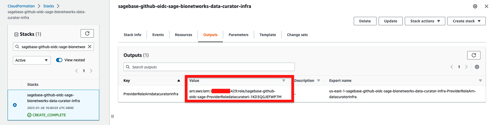

### Purpose of these templates

The templates in this folder are used to setup access between AWS
and other third party services.

#### Continuous Integration Services

There are templates to enable OIDC for CI systems.

A common use-case is to setup [Github OIDC](https://docs.github.com/en/actions/deployment/security-hardening-your-deployments/configuring-openid-connect-in-amazon-web-services)
for a more secure integration between github action and AWS.

To setup github OIDC:
1. Create a PR similar to [#688](https://github.com/Sage-Bionetworks-IT/organizations-infra/pull/688)
and have it reviewed and approved. Note the following important parameters:
* DefaultOrganizationBinding - Set this to the AWS accounts that your repo will deploy to.
* ManagedPolicyArns - Allows the repo to access the AWS accounts with an AWS managed policy.
* PolicyDocument - Allows the repo to access the AWS accounts with an AWS custom policy.
* GitHubOrg - The Github organization to allow OIDC access (i.e. "Sage-Bionetworks")
* Repositories - A dictionary list of repositories and branches in the GitHubOrg to allow OIDC access

Example to allow GH OIDC in Sage-Bionetworks/repoA and Sage-Bionetworks/repoB in AWS AccountX and AWS AccountY:
```yaml
TemplatingContext:
    GitHubOrg: "Sage-Bionetworks"
    Repositories:
      - name: "repoA"
        branches: ["dev","prod"]
      - name: "repoB"
        branches: ["*"]
DefaultOrganizationBinding:
    Account:
      - !Ref AccountX
      - !Ref AccountY
    Region: us-east-1
```
NOTE: `*` indicates all branches.

  Please take care to set a [least privileged policy](https://csrc.nist.gov/glossary/term/least_privilege) for your OIDC integration.

2. Merge the PR and the CI will deploy the new resource to the AWS account(s) specified in the `DefaultOrganizationBinding` parameter.
3. Find the newly created role for the OIDC integration.

Login to the AWS account(s) specified in `DefaultOrganizationBinding` then navigate to
```
-> cloudformation -> search for a stack named something like `Sagebase-github-oidc-*` -> outputs -> ProviderRoleArn
```



4. Take the ProviderRoleArn output value and set it to `role-to-assume`
in a github action to assume a role.

Example using [configure-aws-credentials GH action](https://github.com/aws-actions/configure-aws-credentials):
```
  - name: Assume AWS Role
    uses: aws-actions/configure-aws-credentials@v2
    with:
      aws-region: us-east-1
      role-to-assume: arn:aws:iam::XXXXXXXX:role/sagebase-github-oidc-sage-bionetworks-repo
      role-session-name: GitHubActions-${{ github.repository_owner }}-${{ github.event.repository.name }}-${{ github.run_id }}
      role-duration-seconds: 1200
```


#### Security Services

[Defender for Cloud](https://learn.microsoft.com/en-us/azure/defender-for-cloud/defender-for-cloud-introduction)
for AWS is a comprehensive security solution designed to monitor, protect, and manage
cloud environments within AWS. It provides real-time threat detection, vulnerability
assessments, and compliance management to ensure the security of cloud  workloads and
infrastructure.

The Defender for Cloud for AWS CloudFormation template deploys resources needed to
integrate AWS environments with Microsoft Defender for Cloud. It creates IAM roles
and permissions, enabling security monitoring, data collection, and communication
with Defender for Cloud for continuous threat detection and security posture management.
This streamlines the onboarding of AWS accounts to Defender for Cloud. Specifically,
the roles that will be created for the Sage account are the following:

Defender for Cloud generates a CloudFormation template based on the Cloud Security Posture
Management features used by Defender for Cloud to asses, monitor, and improve the security
posture. The template configures security configurations for protecting AWS environments.
When you integrate AWS accounts with Defender for Cloud, it provides the option to download
a CloudFormation template that automates the process of creating required roles, policies,
and permissions in your AWS account.

__Note__: An Azure subscription along with a Defender for Cloud plan is required
to [generate the cloudformation template](https://learn.microsoft.com/en-us/azure/defender-for-cloud/quickstart-onboard-aws).
The template was provided by our managed security service provider  [StackArmor](https://stackarmor.com/)
